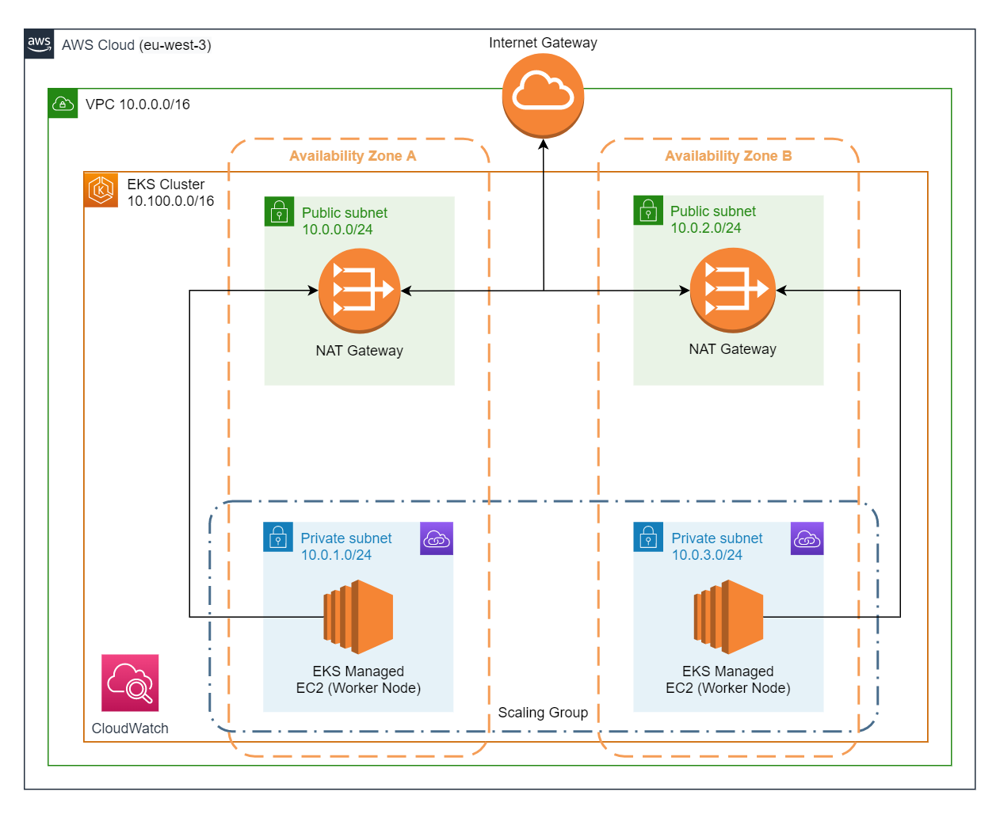

# AWS EKS Module

## Feature highlights

* Automatic configuration of all EKS and related resources.
* Support for multiple subnet use cases, including high availability and automatic route table configuration.
* Includes many best practices being baked into the setup.
* Smart resource naming and tagging strategies, including default resources.
* Automatic subnetting using just a bit number to help prevent miscalculations.
* Optionally store generated SSH private keys locally and or remotely to an S3 bucket with encryption.

**Note:** For multiple NATs across different AZs for high availability, each private subnet will point to its paired public subnet or the last one listed. For example, the first listed private subnet will point to the first listed public subnet with a public NAT and so on.

## Usage

```hcl
module "simple-eks" {
  source = "github.com/StevenJDH/Terraform-Modules//aws/eks?ref=main"

  cluster_name = "simple-example-cluster-dev"

  tags = {
    # Similar to provider tag propagation, but module scoped.
    type = "example"
  }
}

module "custom-eks" {
  source = "github.com/StevenJDH/Terraform-Modules//aws/eks?ref=main"

  cluster_name                     = "custom-example-cluster-dev"
  kubernetes_version               = "1.23"
  enable_cluster_log_types         = ["api", "audit"]
  cloudwatch_log_retention_in_days = 7
  endpoint_private_access          = true
  endpoint_public_access           = true
  public_access_cidrs              = ["0.0.0.0/0"]
  service_ipv4_cidr                = "172.20.0.0/16"
  enable_node_ssh_access           = true
  
  eks_subnet_configuration = [
    {
      new_bits                  = 8
      availability_zone         = "a"
      make_public               = true
      create_nat_gateway        = true
      allow_worker_nodes        = false
    },
    {
      new_bits                  = 8
      availability_zone         = "a"
      make_public               = false
      create_nat_gateway        = false
      allow_worker_nodes        = true
    },
    {
      new_bits                  = 8
      availability_zone         = "b"
      make_public               = true
      create_nat_gateway        = true
      allow_worker_nodes        = false
    },
    {
      new_bits                  = 8
      availability_zone         = "b"
      make_public               = false
      create_nat_gateway        = false
      allow_worker_nodes        = true
    },
  ]
  
  eks_node_group_config = [
    {
      prefix                 = "minion-"
      instance_type          = "t3.micro"
      capacity_type          = "ON_DEMAND"
      disk_size              = 5
      labels                 = {}
      scaling_desired_size   = 1
      scaling_max_size       = 1
      scaling_min_size       = 1
      taints                 = []
      update_max_unavailable = 1
    },
  ]

  tags = {
    # Similar to provider tag propagation, but module scoped.
    type = "example"
  }
}
```

## Default configuration
If no options are configured, then a default, two availability zone EKS cluster will be created using t3.medium worker nodes in private subnets with a public API server endpoint. The below diagram is an overview of this setup, which models one of the use cases found in the [Creating a VPC for your Amazon EKS cluster](https://docs.aws.amazon.com/eks/latest/userguide/creating-a-vpc.html) documentation.



If help is needed for calculating subnets, start [here](https://www.site24x7.com/tools/ipv4-subnetcalculator.html). Additionally, there is great Linux tool called `ipcalc` that can provide a full view with in-depth explanation. See the following examples:

Typing `ipcalc 10.0.0.0/16` will produce a summary:

```bash
Address:   192.168.0.0          11000000.10101000.00000000. 00000000
Netmask:   255.255.255.0 = 24   11111111.11111111.11111111. 00000000
Wildcard:  0.0.0.255            00000000.00000000.00000000. 11111111
=>
Network:   192.168.0.0/24       11000000.10101000.00000000. 00000000
HostMin:   192.168.0.1          11000000.10101000.00000000. 00000001
HostMax:   192.168.0.254        11000000.10101000.00000000. 11111110
Broadcast: 192.168.0.255        11000000.10101000.00000000. 11111111
Hosts/Net: 254                   Class C, Private Internet
```

And typing `ipcalc 10.0.0.0/16 /24` will produce a breakdown based on the choosing prefix size:

```bash
Subnets after transition from /16 to /24

Netmask:   255.255.255.0 = 24   11111111.11111111.11111111. 00000000
Wildcard:  0.0.0.255            00000000.00000000.00000000. 11111111

 1.
Network:   10.0.0.0/24          00001010.00000000.00000000. 00000000
HostMin:   10.0.0.1             00001010.00000000.00000000. 00000001
HostMax:   10.0.0.254           00001010.00000000.00000000. 11111110
Broadcast: 10.0.0.255           00001010.00000000.00000000. 11111111
Hosts/Net: 254                   Class A, Private Internet

 2.
Network:   10.0.1.0/24          00001010.00000000.00000001. 00000000
HostMin:   10.0.1.1             00001010.00000000.00000001. 00000001
HostMax:   10.0.1.254           00001010.00000000.00000001. 11111110
Broadcast: 10.0.1.255           00001010.00000000.00000001. 11111111
Hosts/Net: 254                   Class A, Private Internet

 3...
```

## EKS cluster add-ons
To optionally get specific versions and other details for each supported add-on, type:

```bash
aws eks describe-addon-versions > addons.json
```

Review the `addons.json` file in any text editor.

## EKS Pod limits per node
The number of IP addresses per network interface per instance type will determine the maximum number of pods a node can run. For example, look at the chart below, a `t3.micro` has 2 elastic interfaces, and each ENI can have 2 private IPv4 addresses. Using the formula `Max Pods = (Maximum supported Network Interfaces for instance type ) * ( IPv4 Addresses per Interface ) - (1 reserved node IP)`, the pod limit for this instance type is 2 * 2 - 1 = 3 Pods.

```bash
$ aws ec2 describe-instance-types \
        --filters "Name=instance-type,Values=t3.*" \
        --query "InstanceTypes[].{Type: InstanceType, MaxENI: NetworkInfo.MaximumNetworkInterfaces, IPv4addr: NetworkInfo.Ipv4AddressesPerInterface}" \
        --output table

--------------------------------------
|        DescribeInstanceTypes       |
+----------+----------+--------------+
| IPv4addr | MaxENI   |    Type      |
+----------+----------+--------------+
|  12      |  3       |  t3.large    |
|  15      |  4       |  t3.2xlarge  |
|  15      |  4       |  t3.xlarge   |
|  6       |  3       |  t3.medium   |
|  2       |  2       |  t3.nano     |
|  2       |  2       |  t3.micro    |
|  4       |  3       |  t3.small    |
+----------+----------+--------------+
```

To see the current number of running pods, type:

```bash
kubectl get pods -A | grep -i running | wc -l 
```

and to see what the current pod limits are, type:

```bash
kubectl get nodes -o yaml | grep pods
```

If describing a pod that isn't ready shows a reason of `FailedScheduling` and a message like `0/1 nodes are available: 1 Too many pods`, then either a larger instance type is needed, or the scaling configuration needs to be increased. For more information, see [IP addresses per network interface per instance type](https://docs.aws.amazon.com/AWSEC2/latest/UserGuide/using-eni.html#AvailableIpPerENI).

<!-- BEGIN_TF_DOCS -->
## Requirements

| Name | Version |
|------|---------|
| <a name="requirement_terraform"></a> [terraform](#requirement\_terraform) | >= 1.0.0 |
| <a name="requirement_aws"></a> [aws](#requirement\_aws) | ~> 4.0 |
| <a name="requirement_local"></a> [local](#requirement\_local) | ~> 2.2 |
| <a name="requirement_tls"></a> [tls](#requirement\_tls) | ~> 4.0 |

## Providers

| Name | Version |
|------|---------|
| <a name="provider_aws"></a> [aws](#provider\_aws) | ~> 4.0 |
| <a name="provider_local"></a> [local](#provider\_local) | ~> 2.2 |
| <a name="provider_tls"></a> [tls](#provider\_tls) | ~> 4.0 |

## Modules

| Name | Source | Version |
|------|--------|---------|
| <a name="module_vpc-eks"></a> [vpc-eks](#module\_vpc-eks) | ../vpc | n/a |

## Resources

| Name | Type |
|------|------|
| [aws_cloudwatch_log_group.this](https://registry.terraform.io/providers/hashicorp/aws/latest/docs/resources/cloudwatch_log_group) | resource |
| [aws_eks_addon.this](https://registry.terraform.io/providers/hashicorp/aws/latest/docs/resources/eks_addon) | resource |
| [aws_eks_cluster.this](https://registry.terraform.io/providers/hashicorp/aws/latest/docs/resources/eks_cluster) | resource |
| [aws_eks_node_group.this](https://registry.terraform.io/providers/hashicorp/aws/latest/docs/resources/eks_node_group) | resource |
| [aws_iam_role.eks-cluster](https://registry.terraform.io/providers/hashicorp/aws/latest/docs/resources/iam_role) | resource |
| [aws_iam_role.eks-node](https://registry.terraform.io/providers/hashicorp/aws/latest/docs/resources/iam_role) | resource |
| [aws_iam_role_policy_attachment.ec2-container-registry-read-only](https://registry.terraform.io/providers/hashicorp/aws/latest/docs/resources/iam_role_policy_attachment) | resource |
| [aws_iam_role_policy_attachment.eks-cluster-policy](https://registry.terraform.io/providers/hashicorp/aws/latest/docs/resources/iam_role_policy_attachment) | resource |
| [aws_iam_role_policy_attachment.eks-cni-policy](https://registry.terraform.io/providers/hashicorp/aws/latest/docs/resources/iam_role_policy_attachment) | resource |
| [aws_iam_role_policy_attachment.eks-vpc-resource-controller](https://registry.terraform.io/providers/hashicorp/aws/latest/docs/resources/iam_role_policy_attachment) | resource |
| [aws_iam_role_policy_attachment.eks-worker-node-policy](https://registry.terraform.io/providers/hashicorp/aws/latest/docs/resources/iam_role_policy_attachment) | resource |
| [aws_key_pair.this](https://registry.terraform.io/providers/hashicorp/aws/latest/docs/resources/key_pair) | resource |
| [aws_s3_object.ssh-key-pair](https://registry.terraform.io/providers/hashicorp/aws/latest/docs/resources/s3_object) | resource |
| [local_sensitive_file.ssh-key-pair](https://registry.terraform.io/providers/hashicorp/local/latest/docs/resources/sensitive_file) | resource |
| [tls_private_key.ssh](https://registry.terraform.io/providers/hashicorp/tls/latest/docs/resources/private_key) | resource |
| [aws_region.current](https://registry.terraform.io/providers/hashicorp/aws/latest/docs/data-sources/region) | data source |

## Inputs

| Name | Description | Type | Default | Required |
|------|-------------|------|---------|:--------:|
| <a name="input_cloudwatch_log_retention_in_days"></a> [cloudwatch\_log\_retention\_in\_days](#input\_cloudwatch\_log\_retention\_in\_days) | Specifies the number of days you want to retain log events in the specified log group. Possible values are: 1, 3, 5, 7, 14, 30, 60, 90, 120, 150, 180, 365, 400, 545, 731, 1827, 3653, and 0. If you select 0, the events in the log group are always retained and never expire. | `number` | `90` | no |
| <a name="input_cluster_name"></a> [cluster\_name](#input\_cluster\_name) | The name of the EKS Cluster to create. | `string` | n/a | yes |
| <a name="input_eks_cluster_addons"></a> [eks\_cluster\_addons](#input\_eks\_cluster\_addons) | Installs the default EKS add-ons, which can overridden. If a version is not provided, the latest default version will be used. For more information, see [Amazon EKS add-ons](https://docs.aws.amazon.com/eks/latest/userguide/eks-add-ons.html). | <pre>list(object({<br>    name    = string<br>    version = optional(string)<br>  }))</pre> | <pre>[<br>  {<br>    "name": "kube-proxy",<br>    "version": null<br>  },<br>  {<br>    "name": "vpc-cni",<br>    "version": null<br>  },<br>  {<br>    "name": "coredns",<br>    "version": null<br>  }<br>]</pre> | no |
| <a name="input_eks_node_group_config"></a> [eks\_node\_group\_config](#input\_eks\_node\_group\_config) | Sets the EKS Node Group configuration, which can provision and optionally update an Auto Scaling Group of Kubernetes worker nodes compatible with EKS. | <pre>list(object({<br>    prefix                 = optional(string)<br>    instance_type          = string<br>    capacity_type          = string<br>    disk_size              = number<br>    labels                 = map(string)<br>    scaling_desired_size   = number<br>    scaling_max_size       = number<br>    scaling_min_size       = number<br>    taints                 = list(object({<br>      key    = string<br>      value  = string<br>      effect = string<br>    }))<br>    update_max_unavailable = optional(number)<br>    update_max_unavailable_percentage = optional(number)<br>  }))</pre> | <pre>[<br>  {<br>    "capacity_type": "ON_DEMAND",<br>    "disk_size": 20,<br>    "instance_type": "t3.medium",<br>    "labels": null,<br>    "prefix": "minion-",<br>    "scaling_desired_size": 2,<br>    "scaling_max_size": 2,<br>    "scaling_min_size": 2,<br>    "taints": [],<br>    "update_max_unavailable": 1,<br>    "update_max_unavailable_percentage": null<br>  }<br>]</pre> | no |
| <a name="input_eks_node_group_tags"></a> [eks\_node\_group\_tags](#input\_eks\_node\_group\_tags) | Additional tags for EKS Node Groups. | `map(string)` | `null` | no |
| <a name="input_eks_subnet_configuration"></a> [eks\_subnet\_configuration](#input\_eks\_subnet\_configuration) | Sets the private and public subnet configuration. Choose the availability zone using letters a to c, mark the subnet as public or not, add a private or public NAT Gateway if needed, and select which subnets will host the EKS worker nodes. The new\_bits attribute is the number of additional bits that defines the subnet's IPv4 CIDR block. For more information, see [Amazon EKS VPC and subnet requirements and considerations](https://docs.aws.amazon.com/eks/latest/userguide/network_reqs.html). | <pre>list(object({<br>    new_bits                  = number<br>    availability_zone         = string<br>    make_public               = bool<br>    create_nat_gateway        = bool<br>    allow_worker_nodes        = bool<br>  }))</pre> | <pre>[<br>  {<br>    "allow_worker_nodes": false,<br>    "availability_zone": "a",<br>    "create_nat_gateway": true,<br>    "make_public": true,<br>    "new_bits": 8<br>  },<br>  {<br>    "allow_worker_nodes": true,<br>    "availability_zone": "a",<br>    "create_nat_gateway": false,<br>    "make_public": false,<br>    "new_bits": 8<br>  },<br>  {<br>    "allow_worker_nodes": false,<br>    "availability_zone": "b",<br>    "create_nat_gateway": true,<br>    "make_public": true,<br>    "new_bits": 8<br>  },<br>  {<br>    "allow_worker_nodes": true,<br>    "availability_zone": "b",<br>    "create_nat_gateway": false,<br>    "make_public": false,<br>    "new_bits": 8<br>  }<br>]</pre> | no |
| <a name="input_eks_tags"></a> [eks\_tags](#input\_eks\_tags) | Additional tags for EKS. | `map(string)` | `null` | no |
| <a name="input_enable_cluster_log_types"></a> [enable\_cluster\_log\_types](#input\_enable\_cluster\_log\_types) | List of the desired control plane logging to enable. For more information, see [Amazon EKS Control Plane Logging](https://docs.aws.amazon.com/eks/latest/userguide/control-plane-logs.html). | `list(string)` | <pre>[<br>  "api",<br>  "audit"<br>]</pre> | no |
| <a name="input_enable_node_ssh_access"></a> [enable\_node\_ssh\_access](#input\_enable\_node\_ssh\_access) | Indicates whether or not to provide access for SSH communication with the worker nodes in the EKS Node Groups. If set to true, ensure that the Terraform state file is stored on encrypted storage like an AWS S3 bucket with SSE-S3 enabled to better protect the SSH key in the state file. | `bool` | `false` | no |
| <a name="input_enable_ssh_access_from_internet"></a> [enable\_ssh\_access\_from\_internet](#input\_enable\_ssh\_access\_from\_internet) | Indicates whether or not to open port 22 on the worker nodes to the Internet (0.0.0.0/0). This option is only meant for testing. Setting to it to false will automatically associate the VPC's default security group. | `bool` | `false` | no |
| <a name="input_endpoint_private_access"></a> [endpoint\_private\_access](#input\_endpoint\_private\_access) | Indicates whether or not to enable access to the EKS private API server endpoint. | `bool` | `false` | no |
| <a name="input_endpoint_public_access"></a> [endpoint\_public\_access](#input\_endpoint\_public\_access) | Indicates whether or not to enable access to the EKS public API server endpoint. If set to true, an Internet Gateway is automatically created, and if false, one is still created if `create_nat_gateway` and `make_public` are true in `eks_subnet_configuration`. | `bool` | `true` | no |
| <a name="input_kubernetes_version"></a> [kubernetes\_version](#input\_kubernetes\_version) | Desired Kubernetes master version. If you do not specify a value, the latest available version at resource creation is used and no upgrades will occur except those automatically triggered by EKS. The value must be configured and increased to upgrade the version when desired. Downgrades are not supported by EKS. | `string` | `null` | no |
| <a name="input_private_subnet_tags"></a> [private\_subnet\_tags](#input\_private\_subnet\_tags) | Additional tags for the private subnets. | `map(string)` | `null` | no |
| <a name="input_public_access_cidrs"></a> [public\_access\_cidrs](#input\_public\_access\_cidrs) | Public access source whitelist. Indicates which CIDR blocks can access the Amazon EKS public API server endpoint when enabled. | `list(string)` | <pre>[<br>  "0.0.0.0/0"<br>]</pre> | no |
| <a name="input_public_subnet_tags"></a> [public\_subnet\_tags](#input\_public\_subnet\_tags) | Additional tags for the public subnets. | `map(string)` | `null` | no |
| <a name="input_save_ssh_key_pair_locally"></a> [save\_ssh\_key\_pair\_locally](#input\_save\_ssh\_key\_pair\_locally) | Indicates whether or not to save the generated SSH key pair locally. If this file is removed, or a plan is done from a new machine for automation, Terraform will generate a diff to re-create it. This may cause unwanted noise in a plan. Alternatively, use `save_ssh_key_pair_remotely` instead to mitigate this issue. | `bool` | `true` | no |
| <a name="input_save_ssh_key_pair_remotely"></a> [save\_ssh\_key\_pair\_remotely](#input\_save\_ssh\_key\_pair\_remotely) | Indicates whether or not to save the generated SSH key pair remotely to a pre-created S3 bucket. If set to true, `ssh_key_bucket_name` is required. | `bool` | `false` | no |
| <a name="input_service_ipv4_cidr"></a> [service\_ipv4\_cidr](#input\_service\_ipv4\_cidr) | The CIDR block to assign Kubernetes service IP addresses from. We recommend that you specify a block that does not overlap with resources in other networks that are peered or connected to your VPC. The block must meet the following requirements: Within one of the following private IP address blocks: 10.0.0.0/8, 172.16.0.0/12, or 192.168.0.0/16, doesn't overlap with any CIDR block assigned to the VPC that you selected for VPC, and between /24 and /12. | `string` | `"10.100.0.0/16"` | no |
| <a name="input_ssh_key_bucket_file_key_prefix"></a> [ssh\_key\_bucket\_file\_key\_prefix](#input\_ssh\_key\_bucket\_file\_key\_prefix) | The key prefix for the SSH key pair file to nest within a folder like structure. For example, `/backup/` or `backup/`, with or without the leading slash, will save the SSH key pair file as `backup/my-ssh.key`. Requires `save_ssh_key_pair_remotely` to be set to true. | `string` | `"/"` | no |
| <a name="input_ssh_key_bucket_name"></a> [ssh\_key\_bucket\_name](#input\_ssh\_key\_bucket\_name) | Name of the bucket to save the SSH key pair file to. Requires `save_ssh_key_pair_remotely` to be set to true. The SSH key pair file will be stored with AWS AES256 managed server-side encryption (SSE-S3) in the defined bucket. | `string` | `null` | no |
| <a name="input_ssh_key_pair_rsa_bits"></a> [ssh\_key\_pair\_rsa\_bits](#input\_ssh\_key\_pair\_rsa\_bits) | The size of the generated RSA key pair in bits for SSH. | `number` | `4096` | no |
| <a name="input_tags"></a> [tags](#input\_tags) | Resource tags. | `map(string)` | `null` | no |
| <a name="input_vpc_tags"></a> [vpc\_tags](#input\_vpc\_tags) | Additional tags for the VPC. | `map(string)` | `null` | no |
| <a name="input_worker_nodes_ein_security_group_ids"></a> [worker\_nodes\_ein\_security\_group\_ids](#input\_worker\_nodes\_ein\_security\_group\_ids) | List of security group IDs for the cross-account supporting elastic network interfaces in the selected subnets that EKS creates to use to allow communication between your worker nodes and the Kubernetes control plane. The VPC's default security group is always included whether additional security groups are provided or not. | `list(string)` | `[]` | no |

## Outputs

| Name | Description |
|------|-------------|
| <a name="output_addon_info"></a> [addon\_info](#output\_addon\_info) | n/a |
| <a name="output_api_server_endpoint"></a> [api\_server\_endpoint](#output\_api\_server\_endpoint) | n/a |
| <a name="output_cloudwatch_log_group_arn"></a> [cloudwatch\_log\_group\_arn](#output\_cloudwatch\_log\_group\_arn) | n/a |
| <a name="output_cloudwatch_log_group_id"></a> [cloudwatch\_log\_group\_id](#output\_cloudwatch\_log\_group\_id) | n/a |
| <a name="output_cloudwatch_log_group_name"></a> [cloudwatch\_log\_group\_name](#output\_cloudwatch\_log\_group\_name) | n/a |
| <a name="output_cluster_security_group_id"></a> [cluster\_security\_group\_id](#output\_cluster\_security\_group\_id) | n/a |
| <a name="output_eip_public_nat_ids"></a> [eip\_public\_nat\_ids](#output\_eip\_public\_nat\_ids) | n/a |
| <a name="output_eks_cluster_role_arn"></a> [eks\_cluster\_role\_arn](#output\_eks\_cluster\_role\_arn) | n/a |
| <a name="output_eks_cluster_role_id"></a> [eks\_cluster\_role\_id](#output\_eks\_cluster\_role\_id) | n/a |
| <a name="output_eks_cluster_role_name"></a> [eks\_cluster\_role\_name](#output\_eks\_cluster\_role\_name) | n/a |
| <a name="output_eks_node_role_arn"></a> [eks\_node\_role\_arn](#output\_eks\_node\_role\_arn) | n/a |
| <a name="output_eks_node_role_id"></a> [eks\_node\_role\_id](#output\_eks\_node\_role\_id) | n/a |
| <a name="output_eks_node_role_name"></a> [eks\_node\_role\_name](#output\_eks\_node\_role\_name) | n/a |
| <a name="output_internet_gateway_arn"></a> [internet\_gateway\_arn](#output\_internet\_gateway\_arn) | n/a |
| <a name="output_internet_gateway_id"></a> [internet\_gateway\_id](#output\_internet\_gateway\_id) | n/a |
| <a name="output_kubeconfig_certificate_authority_data"></a> [kubeconfig\_certificate\_authority\_data](#output\_kubeconfig\_certificate\_authority\_data) | n/a |
| <a name="output_kubeconfig_cmd"></a> [kubeconfig\_cmd](#output\_kubeconfig\_cmd) | n/a |
| <a name="output_node_group_arns"></a> [node\_group\_arns](#output\_node\_group\_arns) | n/a |
| <a name="output_node_group_ids"></a> [node\_group\_ids](#output\_node\_group\_ids) | n/a |
| <a name="output_platform_version"></a> [platform\_version](#output\_platform\_version) | n/a |
| <a name="output_public_nat_ids"></a> [public\_nat\_ids](#output\_public\_nat\_ids) | n/a |
| <a name="output_route_table_gateway_arns"></a> [route\_table\_gateway\_arns](#output\_route\_table\_gateway\_arns) | n/a |
| <a name="output_route_table_gateway_ids"></a> [route\_table\_gateway\_ids](#output\_route\_table\_gateway\_ids) | n/a |
| <a name="output_route_table_private_arns"></a> [route\_table\_private\_arns](#output\_route\_table\_private\_arns) | n/a |
| <a name="output_route_table_private_ids"></a> [route\_table\_private\_ids](#output\_route\_table\_private\_ids) | n/a |
| <a name="output_ssh_key_pair_name"></a> [ssh\_key\_pair\_name](#output\_ssh\_key\_pair\_name) | n/a |
| <a name="output_ssh_private_key"></a> [ssh\_private\_key](#output\_ssh\_private\_key) | n/a |
| <a name="output_ssh_private_key_s3_bucket_key"></a> [ssh\_private\_key\_s3\_bucket\_key](#output\_ssh\_private\_key\_s3\_bucket\_key) | n/a |
| <a name="output_ssh_public_key"></a> [ssh\_public\_key](#output\_ssh\_public\_key) | n/a |
| <a name="output_subnet_info"></a> [subnet\_info](#output\_subnet\_info) | n/a |
| <a name="output_vpc_arn"></a> [vpc\_arn](#output\_vpc\_arn) | n/a |
| <a name="output_vpc_default_network_acl_id"></a> [vpc\_default\_network\_acl\_id](#output\_vpc\_default\_network\_acl\_id) | n/a |
| <a name="output_vpc_default_route_table_id"></a> [vpc\_default\_route\_table\_id](#output\_vpc\_default\_route\_table\_id) | n/a |
| <a name="output_vpc_default_security_group_id"></a> [vpc\_default\_security\_group\_id](#output\_vpc\_default\_security\_group\_id) | n/a |
| <a name="output_vpc_id"></a> [vpc\_id](#output\_vpc\_id) | n/a |
| <a name="output_vpc_main_route_table_id"></a> [vpc\_main\_route\_table\_id](#output\_vpc\_main\_route\_table\_id) | n/a |
<!-- END_TF_DOCS -->