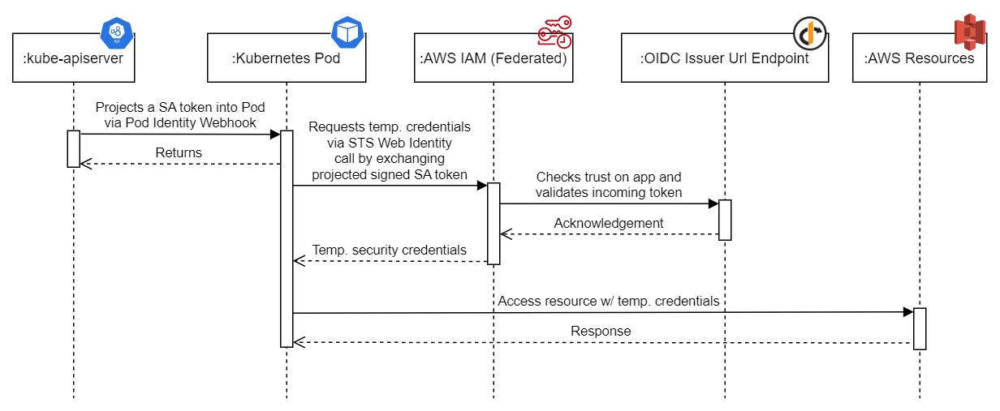

# AWS IAM Roles for Service Accounts (IRSA) Module



Applications in a pod’s containers can use an AWS SDK or the AWS CLI to make API requests to AWS services using AWS Identity and Access Management (IAM) permissions. Applications must sign their AWS API requests with AWS credentials. IAM roles for service accounts provide the ability to manage credentials for your applications, similar to the way that Amazon EC2 instance profiles provide credentials to Amazon EC2 instances. Instead of creating and distributing your AWS credentials to the containers or using the Amazon EC2 instance’s role, you associate an IAM role with a Kubernetes service account and configure your pods to use the service account.

IAM roles for service accounts provide the following benefits:

* **Least privilege** – You can scope IAM permissions to a service account, and only pods that use that service account have access to those permissions. This feature also eliminates the need for third-party solutions such as kiam or kube2iam.
* **Credential isolation** – A pod's containers can only retrieve credentials for the IAM role that's associated with the service account that the container uses. A container never has access to credentials that are used by other containers in other pods. When using IAM roles for service accounts, the pod's containers also have the permissions assigned to the Amazon EKS node IAM role, unless you block pod access to the [Amazon EC2 Instance Metadata Service (IMDS)](https://docs.aws.amazon.com/eks/latest/userguide/AWSEC2/latest/UserGuide/configuring-instance-metadata-service.html). For more information, see [Restrict access to the instance profile assigned to the worker node](https://aws.github.io/aws-eks-best-practices/security/docs/iam/#restrict-access-to-the-instance-profile-assigned-to-the-worker-node).
* **Auditability** – Access and event logging is available through AWS CloudTrail to help ensure retrospective auditing.

For more information, see [Introducing fine-grained IAM roles for service accounts](https://aws.amazon.com/blogs/opensource/introducing-fine-grained-iam-roles-service-accounts/) and [EKS Pod Identity Webhook](https://github.com/aws/amazon-eks-pod-identity-webhook/).

## Feature highlights

* Manages the IAM OIDC Provider associated with the EKS OIDC Issuer Url.
* Manages the creation of IAM Roles for each Service Account across any namespace.
* Optionally manages up to 20 Policies per Role and their assignments.
* Optionally creates the needed irsa Service Account for each namespace when not deployed with helm projects.
* Optionally deploys test resources to validate the irsa setup.

## Usage

```hcl
resource "kubernetes_namespace_v1" "irsa-example" {
  metadata {
    name   = "irsa-example"
  }
}

module "eks-irsa" {
  source = "github.com/StevenJDH/Terraform-Modules//aws/irsa"

  eks_cluster_name        = data.aws_eks_cluster.selected.name
  deploy_irsa_test        = true
  oidc_issuer_url         = data.aws_eks_cluster.selected.identity[0].oidc[0].issuer
  irsa_application_config = [
    {
      application_name       = "irsa-example-app-dev"
      namespace_name         = kubernetes_namespace_v1.irsa-example.metadata[0].name
      create_service_account = true
      service_account_name   = "irsa-example-sa"
      policy_arns            = [
        "arn:aws:iam::aws:policy/AmazonS3ReadOnlyAccess",
      ]
    },
  ]

  tags = {
    # Similar to provider tag propagation, but module scoped.
    type = "example"
  }

  depends_on = [
    kubernetes_namespace_v1.irsa-example,
  ]
}
```

## Testing IRSA
If `deploy_irsa_test` was set to `true`, then test resources such as a Pod (default namespace) and an S3 Bucket were created with a role that allows the Pod to read a text file in this S3 bucket using the AWS CLI and Credential Provider Chain. To see if the setup of irsa was successful, verify that the status and the log output of the Pod are similar to the following:

```bash
$ kubectl get po
NAME        READY   STATUS      RESTARTS   AGE
irsa-test   0/1     Completed   0          3m48s

$ kubectl logs irsa-test
Hello World!
```

Also, verify the following injected properties are present in the test Pod's definition when using describe on it as in the output below:

|         Environment variable | Description                                                                 |
|-----------------------------:|:----------------------------------------------------------------------------|
|  AWS_STS_REGIONAL_ENDPOINTS: | STS regional endpoint injected when `sts-regional-endpoint` is set to true. |
|          AWS_DEFAULT_REGION: | Specifies the AWS Region to send the request to.                            |
|                  AWS_REGION: | The AWS SDK compatible environment variable. Overrides AWS_DEFAULT_REGION.  |
|                AWS_ROLE_ARN: | ARN of an IAM role with a web identity provider.                            |
| AWS_WEB_IDENTITY_TOKEN_FILE: | The path of the projected service account token file.                       |

| Volume mount                                      | Description                                           |
|:--------------------------------------------------|:------------------------------------------------------|
| /var/run/secrets/eks.amazonaws.com/serviceaccount | The path of the projected service account token file. |

| Volume        | Description                           |
|:--------------|:--------------------------------------|
| aws-iam-token | The projected service account volume. |

```bash
$ kubectl describe po irsa-test

Name:         irsa-test
Namespace:    default
Priority:     0
Node:         ip-10-0-1-58.eu-west-3.compute.internal/10.0.1.58
Start Time:   Sun, 11 Sep 2022 12:45:12 +0200
Labels:       <none>
Annotations:  kubernetes.io/psp: eks.privileged
Status:       Succeeded
IP:           10.0.1.146
IPs:
  IP:  10.0.1.146
Containers:
  aws-cli-oidc:
    Container ID:  docker://2100fbdbe1247c4651b8957549712806229c70471d50fdc8fc76167bdb191e2b
    Image:         amazon/aws-cli
    Image ID:      docker-pullable://amazon/aws-cli@sha256:e6bbdd91a0d4d5386934d31c96eb3dad944732b8631d2d67387669176766873e
    Port:          <none>
    Host Port:     <none>
    Command:
      aws
      s3
      cp
      s3://irsa-test-ff143966/irsa-test.txt
      -
    State:          Terminated
      Reason:       Completed
      Exit Code:    0
      Started:      Sun, 11 Sep 2022 12:45:24 +0200
      Finished:     Sun, 11 Sep 2022 12:45:25 +0200
    Ready:          False
    Restart Count:  0
    Environment: (Injected by the webhook)
      AWS_STS_REGIONAL_ENDPOINTS:   regional
      AWS_DEFAULT_REGION:           eu-west-3
      AWS_REGION:                   eu-west-3
      AWS_ROLE_ARN:                 arn:aws:iam::000000000000:role/irsa-role-irsa-test-app
      AWS_WEB_IDENTITY_TOKEN_FILE:  /var/run/secrets/eks.amazonaws.com/serviceaccount/token
    Mounts:
      /var/run/secrets/eks.amazonaws.com/serviceaccount from aws-iam-token (ro) (Injected by the webhook)
      /var/run/secrets/kubernetes.io/serviceaccount from kube-api-access-p8c8g (ro)
Conditions:
  Type              Status
  Initialized       True
  Ready             False
  ContainersReady   False
  PodScheduled      True
Volumes:
  aws-iam-token: (Injected by the webhook)
    Type:                    Projected (a volume that contains injected data from multiple sources)
    TokenExpirationSeconds:  86400
  kube-api-access-p8c8g:
    Type:                    Projected (a volume that contains injected data from multiple sources)
    TokenExpirationSeconds:  3607
    ConfigMapName:           kube-root-ca.crt
    ConfigMapOptional:       <nil>
    DownwardAPI:             true
QoS Class:                   BestEffort
Node-Selectors:              kubernetes.io/os=linux
Tolerations:                 node.kubernetes.io/not-ready:NoExecute op=Exists for 300s
                             node.kubernetes.io/unreachable:NoExecute op=Exists for 300s
Events:
  Type    Reason     Age    From               Message
  ----    ------     ----   ----               -------
  Normal  Scheduled  4m28s  default-scheduler  Successfully assigned default/irsa-test to ip-10-0-1-58.eu-west-3.compute.internal
  Normal  Pulling    4m27s  kubelet            Pulling image "amazon/aws-cli"
  Normal  Pulled     4m18s  kubelet            Successfully pulled image "amazon/aws-cli" in 9.286906811s
  Normal  Created    4m16s  kubelet            Created container aws-cli-oidc
  Normal  Started    4m16s  kubelet            Started container aws-cli-oidc
```

## Helm projects
When the irsa service account will be created and managed by helm, a similar implementation as below should be used to enable the irsa magic.

**serviceaccount.yaml**

```yaml
apiVersion: v1
kind: ServiceAccount
metadata:
  name: {{ include "app.serviceAccountName" . }}
  labels:
    {{- include "app.labels" . | nindent 4 }}
    {{- with .Values.serviceAccount.labels }}
    {{- toYaml . | nindent 4 }}
    {{- end }}
  {{- with .Values.serviceAccount.annotations }}
  annotations:
    {{- toYaml . | nindent 4 }}
  {{- end }}
```

**deployment.yaml**

```yaml
apiVersion: apps/v1
kind: Deployment
metadata:
  name: {{ include "app.fullname" . }}
  labels:
    {{- include "app.labels" . | nindent 4 }}
spec:
  {{- if not .Values.autoscaling.enabled }}
  replicas: {{ .Values.replicaCount }}
  {{- end }}
  selector:
    matchLabels:
      {{- include "app.selectorLabels" . | nindent 6 }}
  template:
    metadata:
      {{- with .Values.podAnnotations }}
      annotations:
        {{- toYaml . | nindent 8 }}
      {{- end }}
      labels:
        {{- include "app.selectorLabels" . | nindent 8 }}
    spec:
      {{- with .Values.imagePullSecrets }}
      imagePullSecrets:
        {{- toYaml . | nindent 8 }}
      {{- end }}
      serviceAccountName: {{ include "app.serviceAccountName" . }}
....
```

**values.yaml**

```yaml
serviceAccount:
  # Labels to add to the irsa service account.
  labels: {}
  # Annotations to add to the irsa service account.
  annotations:
    eks.amazonaws.com/audience: "sts.amazonaws.com"
    eks.amazonaws.com/role-arn: "{ARN of the role for service account}"
    eks.amazonaws.com/sts-regional-endpoints: "true" # Recommended to use regional endpoint in almost all cases.
    eks.amazonaws.com/token-expiration: "86400" # Token is valid for 1 day.
```

<!-- BEGIN_TF_DOCS -->
## Requirements

| Name | Version |
|------|---------|
| <a name="requirement_terraform"></a> [terraform](#requirement\_terraform) | >= 1.0.0 |
| <a name="requirement_aws"></a> [aws](#requirement\_aws) | ~> 4.0 |
| <a name="requirement_kubernetes"></a> [kubernetes](#requirement\_kubernetes) | ~> 2.11 |
| <a name="requirement_random"></a> [random](#requirement\_random) | ~> 3.4 |
| <a name="requirement_tls"></a> [tls](#requirement\_tls) | ~> 4.0 |

## Providers

| Name | Version |
|------|---------|
| <a name="provider_aws"></a> [aws](#provider\_aws) | ~> 4.0 |
| <a name="provider_kubernetes"></a> [kubernetes](#provider\_kubernetes) | ~> 2.11 |
| <a name="provider_random"></a> [random](#provider\_random) | ~> 3.4 |
| <a name="provider_tls"></a> [tls](#provider\_tls) | ~> 4.0 |

## Modules

No modules.

## Resources

| Name | Type |
|------|------|
| [aws_iam_openid_connect_provider.this](https://registry.terraform.io/providers/hashicorp/aws/latest/docs/resources/iam_openid_connect_provider) | resource |
| [aws_iam_role.this](https://registry.terraform.io/providers/hashicorp/aws/latest/docs/resources/iam_role) | resource |
| [aws_iam_role_policy_attachment.this](https://registry.terraform.io/providers/hashicorp/aws/latest/docs/resources/iam_role_policy_attachment) | resource |
| [aws_s3_bucket.irsa-test](https://registry.terraform.io/providers/hashicorp/aws/latest/docs/resources/s3_bucket) | resource |
| [aws_s3_object.irsa-test](https://registry.terraform.io/providers/hashicorp/aws/latest/docs/resources/s3_object) | resource |
| [kubernetes_pod_v1.irsa-test](https://registry.terraform.io/providers/hashicorp/kubernetes/latest/docs/resources/pod_v1) | resource |
| [kubernetes_service_account_v1.this](https://registry.terraform.io/providers/hashicorp/kubernetes/latest/docs/resources/service_account_v1) | resource |
| [random_id.irsa-test](https://registry.terraform.io/providers/hashicorp/random/latest/docs/resources/id) | resource |
| [tls_certificate.oidc-issuer](https://registry.terraform.io/providers/hashicorp/tls/latest/docs/data-sources/certificate) | data source |

## Inputs

| Name | Description | Type | Default | Required |
|------|-------------|------|---------|:--------:|
| <a name="input_deploy_irsa_test"></a> [deploy\_irsa\_test](#input\_deploy\_irsa\_test) | Deploys test resources to validate if the irsa setup is working using the AWS CLI and Credential Provider Chain. When done, make sure to set `deploy_irsa_test` to `false` to cleanup the test resources and avoid additional costs. | `bool` | `false` | no |
| <a name="input_eks_cluster_name"></a> [eks\_cluster\_name](#input\_eks\_cluster\_name) | Name of the EKS cluster. | `string` | n/a | yes |
| <a name="input_irsa_application_config"></a> [irsa\_application\_config](#input\_irsa\_application\_config) | Sets the irsa application configuration, which manages irsa service accounts, roles, token expiration, etc. Default irsa service account token expiration is "86400" (1 day) unless specified differently in seconds. If the irsa service account will be created by a helm project, set `create_service_account` to `false`, and ensure the defined namespace is used. | <pre>list(object({<br>    application_name          = string<br>    namespace_name            = string<br>    create_service_account    = bool<br>    service_account_name      = string<br>    service_account_token_exp = optional(string)<br>    policy_arns               = optional(list(string))<br>  }))</pre> | `[]` | no |
| <a name="input_oidc_issuer_url"></a> [oidc\_issuer\_url](#input\_oidc\_issuer\_url) | The OIDC issuer URL that is associated with the cluster. | `string` | n/a | yes |
| <a name="input_tags"></a> [tags](#input\_tags) | Resource tags. | `map(string)` | `null` | no |

## Outputs

| Name | Description |
|------|-------------|
| <a name="output_oidc_provider_arn"></a> [oidc\_provider\_arn](#output\_oidc\_provider\_arn) | n/a |
| <a name="output_role_details"></a> [role\_details](#output\_role\_details) | n/a |
<!-- END_TF_DOCS -->