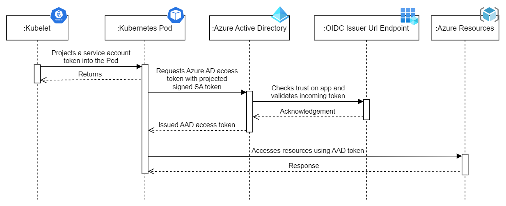

# Azure Workload Identity Module



Azure AD Workload Identity for Kubernetes integrates with the capabilities native to Kubernetes to federate with external identity providers. This approach is simpler to use and deploy, and overcomes several limitations in Azure AD Pod Identity:

* Removes the scale and performance issues that existed for identity assignment.
* Supports Kubernetes clusters hosted in any cloud or on-premises. (This module is only for AKS.)
* Supports both Linux and Windows workloads.
* Removes the need for Custom Resource Definitions and pods that intercept Instance Metadata Service (IMDS) traffic.
* Avoids the complication and error-prone installation steps such as cluster role assignment from the previous iteration.

## Feature highlights

* Optionally installs Workload Identity dependencies.
* Manages the registration of applications across any namespace.
* Optionally manages any number of roles and their assignments per application registration.
* Optionally creates the needed azwi Service Account for each namespace when not deployed with helm projects.
* Optionally deploys test resources to validate the azwi setup.

## Usage

```hcl
resource "kubernetes_namespace_v1" "azwi-example" {
  metadata {
    name   = "azwi-example"
  }
}

module "workload-identity" {
  source = "github.com/StevenJDH/Terraform-Modules//azure/workload-identity"

  azwi_version            = "0.13.0"
  deploy_azwi_system      = true
  deploy_azwi_test        = true
  azwi_test_location      = "West Europe"
  oidc_issuer_url         = data.azurerm_kubernetes_cluster.selected.oidc_issuer_url
  azwi_application_config = [
    {
      application_name       = "azwi-example-app-dev"
      namespace_name         = kubernetes_namespace_v1.azwi-example.metadata[0].name
      create_service_account = true
      service_account_name   = "azwi-example-sa"
      roles                  = [
        {
          scope     = data.azurerm_subscription.primary.id # Reduce role scope for actual use.
          role_name = "Key Vault Secrets User"
        },
      ]
    },
  ]
  
  depends_on = [
    kubernetes_namespace_v1.azwi-example,
  ]
}
```

## Testing AZWI
If `deploy_azwi_test` was set to `true`, then test resources such as a Pod (default namespace) and a Key Vault were created with a role that allows the Pod to read a test secret in this Key Vault using the Microsoft Authentication Library (MSAL). To see if the setup of the Workload Identity system was successful, verify that the log output of the Pod is similar to the following:

```bash
$ kubectl logs azwi-test

I0909 20:00:47.950249       1 main.go:30] "successfully got secret" secret="Hello World!"
```

Also, verify the following injected properties are present in the test Pod's definition when using describe on it as in the output below:

|        Environment variable | Description                                           |
|----------------------------:|:------------------------------------------------------|
|       AZURE_AUTHORITY_HOST: | The Azure Active Directory (AAD) endpoint.            |
|            AZURE_CLIENT_ID: | The client ID of the AAD application.                 |
|            AZURE_TENANT_ID: | The tenant ID of the registered AAD application.      |
| AZURE_FEDERATED_TOKEN_FILE: | The path of the projected service account token file. |

| Volume mount                                       | Description                                           |
|:---------------------------------------------------|:------------------------------------------------------|
| /var/run/secrets/azure/tokens/azure-identity-token | The path of the projected service account token file. |

| Volume               | Description                           |
|:---------------------|:--------------------------------------|
| azure-identity-token | The projected service account volume. |

```bash
$ kubectl describe po azwi-test

Name:         azwi-test
Namespace:    default
Priority:     0
Node:         aks-defaultgru-16752988-vmss000000/10.224.0.4
Start Time:   Fri, 09 Sep 2022 21:08:33 +0200
Labels:       <none>
Annotations:  cni.projectcalico.org/containerID: 4d002995b197965f11993feb19a9fc8d01e54ba61741fc8f2a66cf508a1ea973
              cni.projectcalico.org/podIP: 10.244.0.12/32
              cni.projectcalico.org/podIPs: 10.244.0.12/32
Status:       Running
IP:           10.244.0.12
IPs:
  IP:  10.244.0.12
Containers:
  oidc:
    Container ID:   containerd://c0452b273c3ed527cd13c4210de9b82eb0fb7e5171678bcdbec67b59fb9053bc
    Image:          ghcr.io/azure/azure-workload-identity/msal-go
    Image ID:       ghcr.io/azure/azure-workload-identity/msal-go@sha256:df0b29b634c0da85e78ac31aa8a43730d22301780be13e68f8bbf68d7ff6df1f
    Port:           <none>
    Host Port:      <none>
    State:          Running
      Started:      Fri, 09 Sep 2022 21:08:40 +0200
    Ready:          True
    Restart Count:  0
    Environment:
      KEYVAULT_NAME:               kv-azwi-test-afd2d370
      SECRET_NAME:                 azwi-test
      AZURE_CLIENT_ID:             00000000-0000-0000-0000-000000000000 (Injected by the webhook)
      AZURE_TENANT_ID:             00000000-0000-0000-0000-000000000000 (Injected by the webhook)
      AZURE_FEDERATED_TOKEN_FILE:  /var/run/secrets/azure/tokens/azure-identity-token (Injected by the webhook)
      AZURE_AUTHORITY_HOST:        https://login.microsoftonline.com/ (Injected by the webhook)
    Mounts:
      /var/run/secrets/azure/tokens from azure-identity-token (ro) (Injected by the webhook)
      /var/run/secrets/kubernetes.io/serviceaccount from kube-api-access-dz9zd (ro)
Conditions:
  Type              Status
  Initialized       True
  Ready             True
  ContainersReady   True
  PodScheduled      True
Volumes:
  kube-api-access-dz9zd:
    Type:                    Projected (a volume that contains injected data from multiple sources)
    TokenExpirationSeconds:  3607
    ConfigMapName:           kube-root-ca.crt
    ConfigMapOptional:       <nil>
    DownwardAPI:             true
  azure-identity-token: (Injected by the webhook)
    Type:                    Projected (a volume that contains injected data from multiple sources)
    TokenExpirationSeconds:  86400
QoS Class:                   BestEffort
Node-Selectors:              kubernetes.io/os=linux
Tolerations:                 node.kubernetes.io/not-ready:NoExecute op=Exists for 300s
                             node.kubernetes.io/unreachable:NoExecute op=Exists for 300s
Events:
  Type    Reason     Age   From               Message
  ----    ------     ----  ----               -------
  Normal  Scheduled  48m   default-scheduler  Successfully assigned default/azwi-test to aks-defaultgru-16752988-vmss000000
  Normal  Pulling    48m   kubelet            Pulling image "ghcr.io/azure/azure-workload-identity/msal-go"
  Normal  Pulled     48m   kubelet            Successfully pulled image "ghcr.io/azure/azure-workload-identity/msal-go" in 4.41705601s
  Normal  Created    48m   kubelet            Created container oidc
  Normal  Started    48m   kubelet            Started container oidc
```

## Optional cleanup
When deleting an Azure AD registered application, the app registration itself is not permanently deleted during a terraform destroy. To permanently delete, go to `App registrations` in Azure Active Directory, and under the `Deleted applications` tab, remove the needed entries. 

## Helm projects
When the azwi service account will be created and managed by helm, a similar implementation as below should be used to enable the azwi magic.

**serviceaccount.yaml**

```yaml
apiVersion: v1
kind: ServiceAccount
metadata:
  name: {{ include "app.serviceAccountName" . }}
  labels:
    {{- include "app.labels" . | nindent 4 }}
    {{- with .Values.serviceAccount.labels }}
    {{- toYaml . | nindent 4 }}
    {{- end }}
  {{- with .Values.serviceAccount.annotations }}
  annotations:
    {{- toYaml . | nindent 4 }}
  {{- end }}
```

**deployment.yaml**

```yaml
apiVersion: apps/v1
kind: Deployment
metadata:
  name: {{ include "app.fullname" . }}
  labels:
    {{- include "app.labels" . | nindent 4 }}
spec:
  {{- if not .Values.autoscaling.enabled }}
  replicas: {{ .Values.replicaCount }}
  {{- end }}
  selector:
    matchLabels:
      {{- include "app.selectorLabels" . | nindent 6 }}
  template:
    metadata:
      {{- with .Values.podAnnotations }}
      annotations:
        {{- toYaml . | nindent 8 }}
      {{- end }}
      labels:
        {{- include "app.selectorLabels" . | nindent 8 }}
    spec:
      {{- with .Values.imagePullSecrets }}
      imagePullSecrets:
        {{- toYaml . | nindent 8 }}
      {{- end }}
      serviceAccountName: {{ include "app.serviceAccountName" . }}
....
```

**values.yaml**

```yaml
serviceAccount:
  # Labels to add to the azwi service account.
  labels:
    azure.workload.identity/use: "true" # Represents that this service account is to be used for the workload identity.
  # Annotations to add to the azwi service account.
  annotations:
    azure.workload.identity/client-id: "{Client Id of the azure ad application}"
    azure.workload.identity/service-account-token-expiration: "86400" # Token is valid for 1 day.
```

<!-- BEGIN_TF_DOCS -->
## Requirements

| Name | Version |
|------|---------|
| <a name="requirement_terraform"></a> [terraform](#requirement\_terraform) | >= 1.3.0 |
| <a name="requirement_azuread"></a> [azuread](#requirement\_azuread) | ~> 2.28 |
| <a name="requirement_azurerm"></a> [azurerm](#requirement\_azurerm) | ~> 3.0 |
| <a name="requirement_helm"></a> [helm](#requirement\_helm) | ~> 2.6 |
| <a name="requirement_kubernetes"></a> [kubernetes](#requirement\_kubernetes) | ~> 2.11 |
| <a name="requirement_random"></a> [random](#requirement\_random) | ~> 3.4 |

## Providers

| Name | Version |
|------|---------|
| <a name="provider_azuread"></a> [azuread](#provider\_azuread) | 2.28.1 |
| <a name="provider_azurerm"></a> [azurerm](#provider\_azurerm) | 3.21.1 |
| <a name="provider_helm"></a> [helm](#provider\_helm) | 2.6.0 |
| <a name="provider_kubernetes"></a> [kubernetes](#provider\_kubernetes) | 2.13.1 |
| <a name="provider_random"></a> [random](#provider\_random) | 3.4.2 |

## Modules

No modules.

## Resources

| Name | Type |
|------|------|
| [azuread_application.this](https://registry.terraform.io/providers/hashicorp/azuread/latest/docs/resources/application) | resource |
| [azuread_application_federated_identity_credential.this](https://registry.terraform.io/providers/hashicorp/azuread/latest/docs/resources/application_federated_identity_credential) | resource |
| [azuread_service_principal.this](https://registry.terraform.io/providers/hashicorp/azuread/latest/docs/resources/service_principal) | resource |
| [azurerm_key_vault.azwi-test](https://registry.terraform.io/providers/hashicorp/azurerm/latest/docs/resources/key_vault) | resource |
| [azurerm_key_vault_secret.azwi-test](https://registry.terraform.io/providers/hashicorp/azurerm/latest/docs/resources/key_vault_secret) | resource |
| [azurerm_resource_group.azwi-test](https://registry.terraform.io/providers/hashicorp/azurerm/latest/docs/resources/resource_group) | resource |
| [azurerm_role_assignment.azwi-test-kv-secrets-officer](https://registry.terraform.io/providers/hashicorp/azurerm/latest/docs/resources/role_assignment) | resource |
| [azurerm_role_assignment.this](https://registry.terraform.io/providers/hashicorp/azurerm/latest/docs/resources/role_assignment) | resource |
| [helm_release.azure-workload-identity-system](https://registry.terraform.io/providers/hashicorp/helm/latest/docs/resources/release) | resource |
| [kubernetes_namespace_v1.this](https://registry.terraform.io/providers/hashicorp/kubernetes/latest/docs/resources/namespace_v1) | resource |
| [kubernetes_pod_v1.azwi-test](https://registry.terraform.io/providers/hashicorp/kubernetes/latest/docs/resources/pod_v1) | resource |
| [kubernetes_service_account_v1.this](https://registry.terraform.io/providers/hashicorp/kubernetes/latest/docs/resources/service_account_v1) | resource |
| [random_id.azwi-test](https://registry.terraform.io/providers/hashicorp/random/latest/docs/resources/id) | resource |
| [azuread_client_config.current](https://registry.terraform.io/providers/hashicorp/azuread/latest/docs/data-sources/client_config) | data source |

## Inputs

| Name | Description | Type | Default | Required |
|------|-------------|------|---------|:--------:|
| <a name="input_azwi_application_config"></a> [azwi\_application\_config](#input\_azwi\_application\_config) | Sets the azwi application configuration, which manages app registrations, azwi service accounts, roles, etc. Default azwi service account token expiration is "86400" (1 day) unless specified differently in seconds. If the azwi service account will be created by a helm project, set `create_service_account` to `false`, and ensure the defined namespace is used. For more info, see `Labels and Annotations` [[here](https://azure.github.io/azure-workload-identity/docs/topics/service-account-labels-and-annotations.html)] or [[here](https://github.com/Azure/azure-workload-identity/blob/main/docs/book/src/topics/service-account-labels-and-annotations.md)]. | <pre>list(object({<br>    application_name          = string<br>    namespace_name            = string<br>    create_service_account    = bool<br>    service_account_name      = string<br>    service_account_token_exp = optional(string, "86400")<br>    roles                     = optional(list(object({<br>      scope     = string<br>      role_name = string<br>    })))<br>  }))</pre> | `[]` | no |
| <a name="input_azwi_test_location"></a> [azwi\_test\_location](#input\_azwi\_test\_location) | Azure location for azwi test resources. | `string` | `"West Europe"` | no |
| <a name="input_azwi_version"></a> [azwi\_version](#input\_azwi\_version) | Version of Workload Identity system to deploy if latest is not desired or version pinning is needed. | `string` | `"latest"` | no |
| <a name="input_deploy_azwi_system"></a> [deploy\_azwi\_system](#input\_deploy\_azwi\_system) | Deploy the Azure AD Workload Identity system. See [AZWI Introduction](https://github.com/Azure/azure-workload-identity/blob/main/docs/book/src/introduction.md) for more information | `bool` | `false` | no |
| <a name="input_deploy_azwi_test"></a> [deploy\_azwi\_test](#input\_deploy\_azwi\_test) | Deploys test resources to validate if the azwi setup is working using the Microsoft Authentication Library (MSAL). When done, make sure to set `deploy_azwi_test` to `false` to cleanup the test resources and avoid additional costs. | `bool` | `false` | no |
| <a name="input_oidc_issuer_url"></a> [oidc\_issuer\_url](#input\_oidc\_issuer\_url) | The OIDC issuer URL that is associated with the cluster. | `string` | n/a | yes |
| <a name="input_tags"></a> [tags](#input\_tags) | Resource tags for test resources only. | `map(string)` | `null` | no |

## Outputs

| Name | Description |
|------|-------------|
| <a name="output_azuread_app_details"></a> [azuread\_app\_details](#output\_azuread\_app\_details) | n/a |
<!-- END_TF_DOCS -->